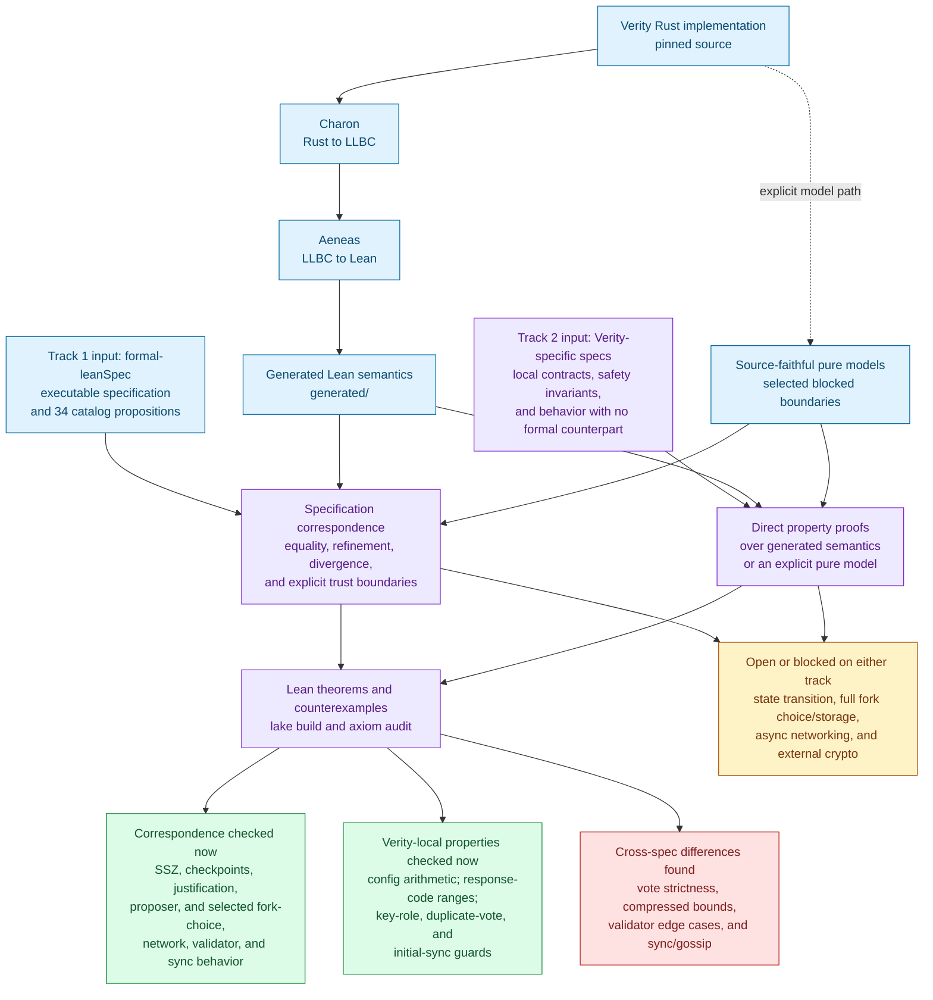

# verity-aeneas-proofs

Aeneas-generated Lean semantics for [Verity](https://github.com/NyxFoundation/verity), handwritten correspondence proofs against [formal-leanSpec](https://github.com/NyxFoundation/formal-leanSpec), and Verity-specific implementation properties.

This repository owns verification artifacts, not production consensus code. It was initialized from Verity PRs [#49](https://github.com/NyxFoundation/verity/pull/49) and [#56](https://github.com/NyxFoundation/verity/pull/56).

## Current result

The correspondence ledger classifies every surveyed Verity/formal-leanSpec boundary and all 34 theorem propositions in the formal catalog. Checked Lean results cover:

- SSZ ranges, byte lengths, hash delegation, and error refinement;
- checkpoint ordering/advancement, justification, proposer selection, slot-clock, and configuration arithmetic;
- fork-choice candidate eligibility and vote replacement, including a strict/non-strict counterexample;
- response codes, varint size, networking constants, and compressed-bound counterexamples;
- validator safety gates and sync-state refinement, with checked boundary divergences.

State transition, full fork choice/storage, async networking, and external crypto remain limited by the concrete extraction or contract boundaries recorded in [`docs/correspondence-survey.md`](docs/correspondence-survey.md). These results do not prove the whole client or protocol safety.

The same Lean implementation semantics can also support Verity-specific proofs without a formal-leanSpec counterpart. Checked examples include extracted configuration arithmetic and pure-model properties for key-role separation, duplicate-vote prevention within its non-overflowing domain, response-code ranges, and initial sync behavior.

## Proof architecture and current status



The solid implementation path is the checked-in Charon/Aeneas translation. The dotted implementation path is used only for explicitly identified source-faithful models when extraction cannot expose a usable function. Track 1 compares Verity with formal-leanSpec; Track 2 states and proves properties owned by Verity itself, including behavior with no formal counterpart. A local model theorem is not automatically an extracted-function theorem, and neither track currently establishes whole-client correctness.

## Repository layout

| Path | Ownership |
|---|---|
| `generated/` | Charon/Aeneas output; never edit manually |
| `proofs/` | Handwritten external models, correspondence theorems, and Verity-specific properties |
| `lean/` | Symlinked Lean module tree consumed by Lake |
| `docs/` | Extractability survey and reproduction notes |
| `scripts/` | Pinned source checkout, regeneration, integrity checks, and manual verification |
| `sources.lock` | Exact source, specification, and tool revisions |

## Reproduce

Prerequisites are Git, Python 3.11 or newer, Rust/Cargo, and cargo-hax 0.4.0:

```sh
cargo install cargo-hax --version 0.4.0 --locked
./scripts/bootstrap.sh
./scripts/extract.sh
git diff --exit-code -- generated artifacts.sha256
./scripts/verify.sh
```

`extract.sh` checks out the exact Verity revision from `sources.lock`, installs the pinned Charon and Aeneas binaries through cargo-hax, and replaces only `generated/`. `verify.sh` checks artifact integrity, rejects handwritten `sorry`/`admit`, builds every Lean target, verifies that every public correspondence theorem is listed in the axiom audit, and prints those dependencies.

GitHub Actions intentionally runs only the lightweight artifact-integrity check. Lean and Aeneas execution remains an explicit local operation because of its resource cost.

See [Reproduction and maintenance](docs/reproduction.md) for the update procedure and [the correspondence survey](docs/correspondence-survey.md) for the wider proof inventory.

## License

MIT © Nyx Foundation
