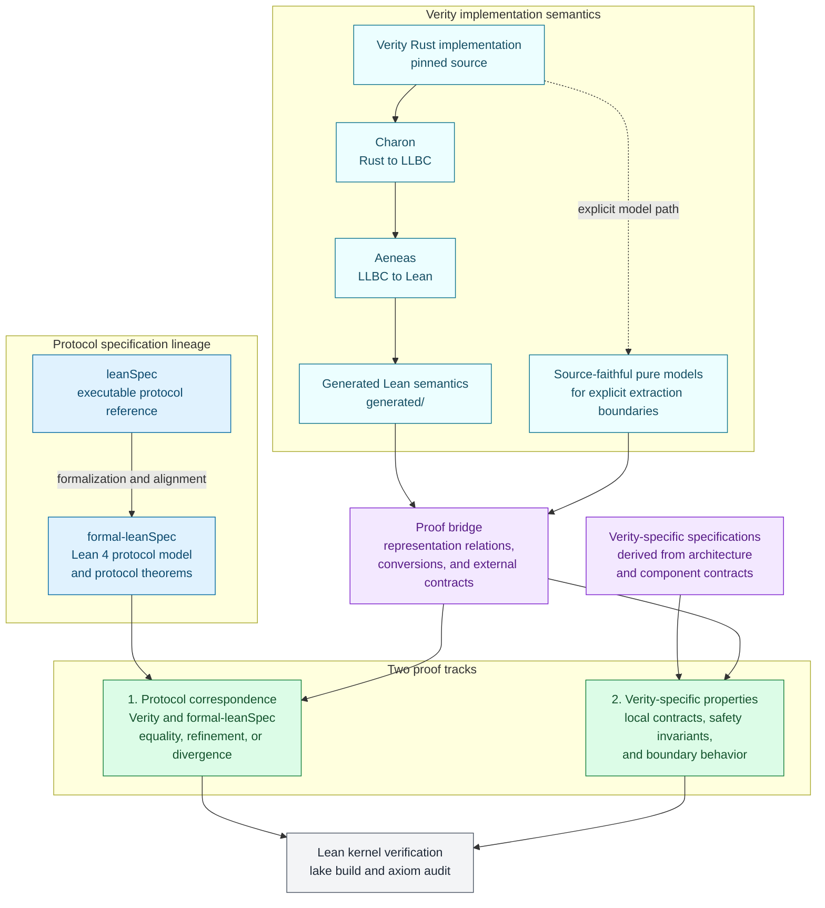

# verity-aeneas-proofs

Aeneas-generated Lean semantics for [Verity](https://github.com/NyxFoundation/verity), handwritten correspondence proofs against [formal-leanSpec](https://github.com/NyxFoundation/formal-leanSpec)—the Lean formalization of the upstream [leanSpec](https://github.com/leanEthereum/leanSpec) executable protocol reference—and Verity-specific implementation properties.

This repository owns verification artifacts, not production consensus code. It was initialized from Verity PRs [#49](https://github.com/NyxFoundation/verity/pull/49) and [#56](https://github.com/NyxFoundation/verity/pull/56).

## Current result

The correspondence ledger classifies every surveyed Verity/formal-leanSpec boundary and all 34 theorem propositions in the formal catalog. Checked Lean results cover:

- SSZ ranges, byte lengths, hash delegation, and error refinement;
- checkpoint ordering/advancement, justification, proposer selection, slot-clock, and configuration arithmetic;
- fork-choice candidate eligibility and vote replacement, including a strict/non-strict counterexample;
- response codes, varint size, networking constants, and compressed-bound counterexamples;
- validator safety gates and sync-state refinement, with checked boundary divergences.

State transition, full fork choice/storage, async networking, and external crypto remain limited by the concrete extraction or contract boundaries recorded in the [correspondence survey](docs/inventory/correspondence-survey.md). These results do not prove the whole client or protocol safety.

The same Lean implementation semantics can also support Verity-specific proofs without a formal-leanSpec counterpart. Checked examples include extracted configuration arithmetic and pure-model properties for key-role separation, duplicate-vote prevention within its non-overflowing domain, response-code ranges, and initial sync behavior.

## Why both are represented in Lean

The two Lean representations serve different proof obligations:

- **leanSpec → formal-leanSpec: prove the protocol specification itself.** The purpose is to state the intended protocol behavior mathematically, prove safety properties and cross-cutting invariants, and expose ambiguity, inconsistency, or missing preconditions in the executable reference specification. The formal model defines the standard against which clients can be assessed.
- **Verity → Lean implementation semantics: prove claims about the actual client.** The purpose is to show where the Rust implementation satisfies or refines the formal protocol model, prove Verity-specific contracts and safety properties, and make implementation divergences and external trust boundaries explicit.

These are not two ways to generate the same Lean program: the first establishes what should be true of the protocol, while the second establishes what is true of Verity and connects it to that standard.

## Proof architecture



`leanSpec` is the executable protocol reference; `formal-leanSpec` expresses that protocol as Lean definitions and theorems. Their alignment is an upstream specification obligation, while Track 1 relates Verity's implementation semantics to the formal model. Track 2 proves contracts and invariants owned by Verity even when no protocol-level counterpart exists. The solid implementation path is the checked-in Charon/Aeneas translation; the dotted path denotes an explicit source-faithful model rather than an extracted function.

## Proposition inventory

The 75 audited public Lean theorems are grouped by semantic obligation rather than forced into a one-to-one mapping with formal-leanSpec's catalog.

- **Correspondence propositions:** representation and SSZ bridges; justification, proposer, checkpoint, slot-clock, and configuration correspondence; error refinement; fork-choice relations; validator and sync differences; response-code, varint, networking-constant, and compressed-bound correspondence.
- **Verity-specific propositions:** finite-width arithmetic bridges; exact extracted branch behavior; configuration consistency and hash delegation; key-separation and duplicate-vote gates; sync initialization; and response-byte classification.

See the [public proposition inventory](docs/inventory/public-propositions.md) for each grouped proposition, its formal or Verity obligation, whether it targets Aeneas output or an explicit pure model, and all supporting public theorem names.

## Repository layout

| Path | Ownership |
|---|---|
| `generated/` | Charon/Aeneas output; never edit manually |
| `proofs/` | Handwritten external models, correspondence theorems, and Verity-specific properties |
| `lean/` | Symlinked Lean module tree consumed by Lake |
| `docs/` | Indexed inventories, domain evidence, and operations guides |
| `scripts/` | Pinned source checkout, regeneration, integrity checks, and manual verification |
| `sources.lock` | Exact source, specification, and tool revisions |

## Reproduce

Prerequisites are Git, Python 3.11 or newer, Rust/Cargo, and cargo-hax 0.4.0:

```sh
cargo install cargo-hax --version 0.4.0 --locked
./scripts/bootstrap.sh
./scripts/extract.sh
git diff --exit-code -- generated artifacts.sha256
./scripts/verify.sh
```

`extract.sh` checks out the exact Verity revision from `sources.lock`, installs the pinned Charon and Aeneas binaries through cargo-hax, and replaces only `generated/`. `verify.sh` checks artifact integrity, rejects handwritten `sorry`/`admit`, builds every Lean target, verifies that every public correspondence theorem is listed in the axiom audit, and prints those dependencies.

GitHub Actions intentionally runs only the lightweight artifact-integrity check. Lean and Aeneas execution remains an explicit local operation because of its resource cost.

See the [documentation index](docs/README.md) for the recommended reading order, [Reproduction and maintenance](docs/operations/reproduction.md) for the update procedure, and the [correspondence survey](docs/inventory/correspondence-survey.md) for the wider proof inventory.

## License

MIT © Nyx Foundation
